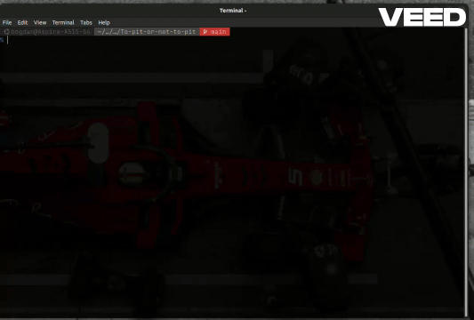

# 🏎️ To pit or not pit...

A **memory management** CLI app, built in **C**
to analyze sensors data of a Ferrari **Formula 1** car.


> ⚠️ Spoiler Alert!
> This is **NOT** a **data acquisition** project.

> Sensors values have already been 'collected' and stored in `*.dat` **binary files**.

## Story Telling

In this **fictional scenario in which my project takes place**,
Ferrari engineers needed my software expertise to stay competitive during F1 season.
They discovered that faulty sensors (likely cheap ones from AliExpress 😉)
were feeding incorrect data into their systems, affecting performance decisions.

**My job was clear**:
develop solutions to detect and eliminate bad data,
ensuring the team works with accurate insights.
By doing so, I played a direct role in helping Ferrari chase victory on the F1 track.

## Sensor Types

In this scenario, there are 2 types of faulty sensors in a Formula 1 car:
1. **PMU** (Power Management Unit) Sensors
2. **Tire** Sensors

Each sensor type has its priority and associated function callss.


## 👨‍💻 Software Commands I Provide to Ferrari Engineers

### 1. Simple Print (`print <index>`)
---

It will the print the data received by the sensor the given index.

In the case of an invalid value, the following error message will appear: `Index not in range!`.


Expected output for **PMU Sensors**:
```
Power Management Unit
Voltage: <voltage>
Current: <current>
Power Consumption: <power_consumption>
Energy Regen: <energy_regen>
Energy Storage: <energy_storage>
```

Expected output for **Tire Sensors**:
```
Tire Sensor
Pressure: <pressure>
Temperature: <temperature>
Wear Level: <wear_level>
Performance Score: <computed score>/Performance Score: Not Calculated
```


### 2. Priority Printing
---

It will show data from all sensors, sorting after their type:
**PMU sensors** are more important than **Tire Sensors**.


### 3. Analyze (`analyze <index>`)
---

It will call the functions associated to the given sensor.

Like **simple print**, the `Index not in range!` will appear if the index is invalid.

### 4. `clear`
---

It will delete mulfunctioning sensors (containing error-prone values) from the array of sensors.


### 5. `exit`
---

Gracefully shut down the program after free-ing the memory.


## 👨‍💻 Preview





## ▶️ How to run the CLI app


```sh
cd src/
make
./main ../checker/input/<sensor-file>.dat < ../checker/input/<command-file>.in
```

Example:

```sh
./main ../checker/input/sensors_print_easy_1.dat < ../checker/input/commands_print_easy_1.in
```

🧹 Don't forget to remove the object and binary files:
```sh
make clean
```


## `>_` User Input

- **Command line argument**: path to the `*.dat` file containing sensors data
  - > Use `sensors_*.dat` from [`checker/input/`](./checker/input/)
- **Stdandard input**: the *"operations"* to perform on sensors data
  - > Use `commands_*.in` from [`checker/input/`](./checker/input/)

💡 A more elegant solution to run the executable
would be to use **input redirection** (`<`) to provide commands from a file,
as shown in the examples above.


## Data Structures for Sensors


Sensor:
```c
typedef struct {
	enum sensor_type sensor_type;
	void *sensor_data;
	int nr_operations;
	int *operations_idxs;
} sensor;
```


**PMU** sensor data:
```c
typedef struct __attribute__((__packed__)) {
	float voltage;
	float current;
	float power_consumption;
	int energy_regen;
	int energy_storage;
} power_management_unit;
```


**Tire** sensor data:
```c
typedef struct __attribute__((__packed__)) {
	float pressure;
	float temperature;
	int wear_level;
	int performace_score;
} tire_sensor;

```


## 👨‍💻 My Implementation

### Sensor Priority
---


The values of **Power Management Unit** sensors
are more important than those received from **Tyre Sensors**.
Thus, the Ferrari team will want the **PMU** values to be the first in the sensor vector.

We receive the following sensors as input:
```
Tire_1 Tire_2 PMU_1 PMU_2 Tire_3 PMU_3 Tire_4 Tire_5 PMU_4
```

The vector will contain the sensors in the following order:
```
PMU_1 PMU_2 PMU_3 PMU_4 Tire_1 Tire_2 Tire_3 Tire_4 Tire_5
```

### 🔗 Sorting Sensors using **Linked Lists**
---


Sorting the array of sensors by type takes place while reading the input file.

Let me walk you through.

To store sensors and group them by type, I used **two linked lists**
1. 🔗 one for **PMU** sensors
2. 🔗 the second one for **Tire** sensors


```c
typedef struct node {
	sensor sensor;
	struct node *next;
} ListNode;
```

> 🎯 With this **data structure**,
> I achieved to preserve the original file order for each sensor type.

Keeping a **pointer to the end of each list** (tail pointer)
**makes append operations faster**,
in just `O(1)`, without having to iterate the list before adding a new sensor.


Let's take a look at **PMU** sensor for example:
```c
// Read PMU sensor data from file
sensor sensor = fread_PMU_sensor_values(fin);

if (!pmu_sensors_head) {
  // Initialize linked list
  pmu_sensors_head = pmu_sensors_tail = new_list_node(sensor);
} else {
  // Append to the end of list
  pmu_sensors_tail->next = new_list_node(sensor);
  pmu_sensors_tail = pmu_sensors_tail->next;
}
```

After reading, I **concatenated** both lists **into an array**
(deallocating memory as I iterate them).

The resulted array will contain all **PMU** sensors first,
followed by all **Tire** sensors.

Excluding file I/O, sorting runs at a **time complexity** of exact `Θ(N)`.

### Analyze Sensors (Function call)
---


**Requirement**: The coresponding sensor functions MUST BE called through the array.

> Under no circumstances the functions can be explicitally called.


In order to do so, I've created a **pointer of eight elements**, **each element pointing to a specific function**.

For the actual call of the function,
I made a **pointer casting** to extract the desired function.
The call is made using the `sensor_data` field of the `sensor` data structure.


```c
int idx = 0;     // sensor index
scanf("%d", &idx);
if (0 <= idx && idx <= num_sensors - 1) {
  void *operations[NUM_OPERATIONS];
  get_operations(operations);
  for (int i = 0; i < sensors_array[idx].nr_operations; i++) {
    // operations call :
    ((void (*)()) operations[sensors_array[idx]
      .operations_idxs[i]]) (sensors_array[idx]
      .sensor_data);
      // equivalent to f();
  }
}
```


## ✅🔁 Automated Tests

Curious how everything gets tested automatically?

Take a look at the [checker/](./checker/) folder.


### 🧪 GitHub Actions | CI Pipeline
---

No test suite is complete without **Continous Integration**.

I've set up the automated checker with **GitHub Actions**
to run tests on every push and pull request.

Take a look at the CI workflow here:
[.github/workflows/checker-tests.yml](.github/workflows/checker-tests.yml).


### 🌃 Overnight Testing
---

Tests not only **run at every commit/pull request**,
but furthermore, I've configured the workflow
to automatically run an **overnight build** in GitHub Actions.

```yml
on:
  schedule:
    # Overnight: run tests every day at 03:15 UTC 
    - cron: "15 3 * * *"
```

Let's break down the `cron` field:
```yml
cron <minute> <hour> <day-of-month> <day-of-week (sunday=0)>
```
