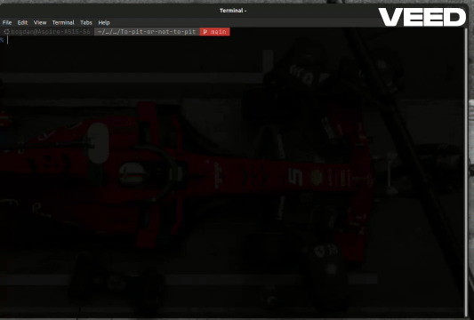

# 🏎️ To pit or not pit...

A **data management** CLI app,
built to analyze sensors values of a Ferrari **Formula 1** car.


> ⚠️ Spoiler Alert!
> This is **NOT** a **data acquisition** project.

> Sensors values have already been 'collected' and stored in `*.dat` **binary files**.

## 👨‍💻 Preview





## Story Telling

In this **fictional scenario in which my project takes place**,
Ferrari engineers needed my software expertise to stay competitive during F1 season.
They discovered that faulty sensors (likely cheap ones from AliExpress 😉)
were feeding incorrect data into their systems, affecting performance decisions.

**My job was clear**:
develop solutions to detect and eliminate bad data,
ensuring the team works with accurate insights.
By doing so, I played a direct role in helping Ferrari chase victory on the F1 track.

## Sensor Types

In this scenario, there are 2 types of faulty sensors in a Formula 1 car:
1. **PMU** (Power Management Unit) Sensors
2. **Tire** Sensors

Each sensor type has its priority and associated function calls.

## Sensor Priority


Ferrari’s telemetry prioritizes **PMU** readings over **Tire** readings.
The output array must have **all PMU sensors first**, followed by all Tire sensors.

If we receive the following input (read order):
```
Tire_1 Tire_2 PMU_1 PMU_2 Tire_3 PMU_3 Tire_4 Tire_5 PMU_4
```

The vector will contain the sensors in the following order (sorted by priority):
```
PMU_1 PMU_2 PMU_3 PMU_4 Tire_1 Tire_2 Tire_3 Tire_4 Tire_5
```


## 👨‍💻 Software Commands I Provide to Ferrari Engineers

### 1. Simple Print (`print <index>`)
---

It will the print the data received by the sensor the given index.

In the case of an invalid value, the following error message will appear: `Index not in range!`.


Expected output for **PMU Sensors**:
```
Power Management Unit
Voltage: <voltage>
Current: <current>
Power Consumption: <power_consumption>
Energy Regen: <energy_regen>
Energy Storage: <energy_storage>
```

Expected output for **Tire Sensors**:
```
Tire Sensor
Pressure: <pressure>
Temperature: <temperature>
Wear Level: <wear_level>
Performance Score: <computed score>/Performance Score: Not Calculated
```


### 2. Priority Printing
---

It will show data from all sensors, sorting after their type:
**PMU sensors** are more important than **Tire Sensors**.


### 3. Analyze (`analyze <index>`)
---

It will call the functions associated to the given sensor.

Like **simple print**, the `Index not in range!` will appear if the index is invalid.

### 4. `clear`
---

It will delete mulfunctioning sensors (containing error-prone values) from the array of sensors.


### 5. `exit`
---

Gracefully shut down the program after free-ing the memory.


## `>_` User Input

- **Command line argument**: path to the `*.dat` file containing sensors data
  - > Use `sensors_*.dat` from [`checker/input/`](./checker/input/)
- **Stdandard input**: the *"operations"* to perform on sensors data
  - > Use `commands_*.in` from [`checker/input/`](./checker/input/)

💡 A more elegant solution to run the executable
would be to use **input redirection** (`<`) to provide commands from a file,
as shown in the examples above.


